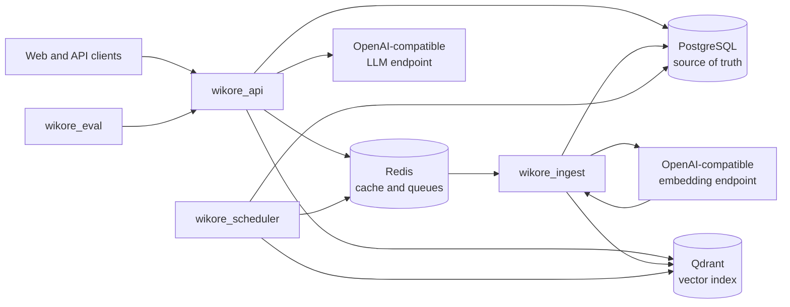

# Wikore

Wikore is a permission-aware enterprise wiki and retrieval-augmented generation
(RAG) backend. It keeps tenant and organizational access rules in PostgreSQL,
indexes document chunks in Qdrant, and uses Redis for queues and short-lived
coordination.

The project is written in C++23 with Drogon and follows a modular-monolith
design with separate worker processes for expensive or scheduled work.

> **Project status:** active development. The foundation is in place and the
> Iteration 1 ingestion path is being built. Several HTTP routes and later RAG
> features are still stubs.

## Architecture



The four binaries have distinct responsibilities:

- `wikore_api` serves authenticated wiki, document, chat, and administration APIs.
- `wikore_ingest` parses, chunks, embeds, and indexes documents.
- `wikore_scheduler` handles outbox delivery, recovery sweeps, and maintenance.
- `wikore_eval` runs retrieval and answer-quality evaluations.

PostgreSQL remains authoritative. Redis and Qdrant are derived stores that can
be repaired through queued work and the transactional outbox.

## Build

On Ubuntu 24.04, install the system dependencies used by CI:

```sh
sudo apt-get install cmake ninja-build ccache libspdlog-dev libssl-dev \
  libhiredis-dev libjsoncpp-dev libpq-dev uuid-dev git
```

Configure and build:

```sh
cmake -B build -G Ninja \
  -DCMAKE_BUILD_TYPE=Release \
  -DWIKORE_NATIVE_OPTS=OFF
cmake --build build --parallel
```

CMake fetches Drogon, Glaze, jwt-cpp, and Catch2 during configuration.

## Test

```sh
# C++ unit tests
ctest --test-dir build --output-on-failure

# PostgreSQL schema smoke tests (requires Docker)
make smoke

# Deterministic parser corpus checks
make corpus-test corpus-verify
```

For PostgreSQL and Redis integration tests, build in `build-ci` and run:

```sh
bash scripts/test_integration_local.sh
```

## Configuration

Runtime configuration is read from environment variables. Start with
[`.env.example`](.env.example), adjust the service URLs and credentials, then
export the variables before launching a binary:

```sh
cp .env.example .env
# Edit .env for your local services.
set -a
source .env
set +a
./build/apps/api/wikore_api
```

Local operation requires PostgreSQL and Redis. Ingestion and retrieval also
require Qdrant and OpenAI-compatible embedding/LLM endpoints.
